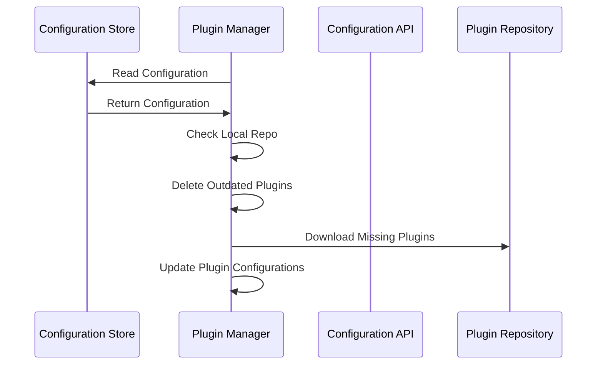

# Plugin Manager

The Plugin Manager is responsible for downloading the Attestation Plugins from the central repository and passing the necessary configuration for them to run.

```mermaid
sequenceDiagram
    participant CM as Configuration Store
    participant PM as Plugin Manager
    participant CA as Configuration API
    participant PR as Plugin Repository

    PM ->> CM: Read Configuration
    CM ->> PM: Return Configuration
    PM ->> PM: Check Local Repo
    PM ->> PM: Delete Outdated Plugins
    PM ->> PR: Download Missing Plugins
    PM ->> PM: Update Plugin Configurations
```

