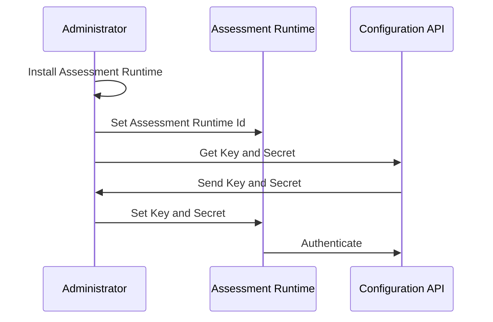

# Authentication

1. The process begins with the Administrator installing the **Assessment Runtime** on a designated system. This system has access to the component that is subject to assessment.
2. The Administrator sets the **Assessment Runtime ID** for the **Assessment Runtime**.
3. The Administrator sends a request to the **Configuration API** to obtain a **Key** and **Secret**.  In the future, this process will be handled by a UI application, which will streamline and likely automate many of these steps.
4. The **Configuration API** sends the requested **Key** and **Secret** back to the Administrator.
5. The Administrator configures the **Assessment Runtime** with the received **Key** and **Secret**.
6. The **Assessment Runtime** uses the **Key** and **Secret** to authenticate for further API calls with the **Configuration API**.

:::tip
The gateway is not shown in the diagrams to clearly illustrate the general flow. It is safe to assume that all communication will go through the gateway and be validated as such.

The diagram also doesn’t include the UI to administer the runtimes. It will be included in the future when the UI development is done.
:::