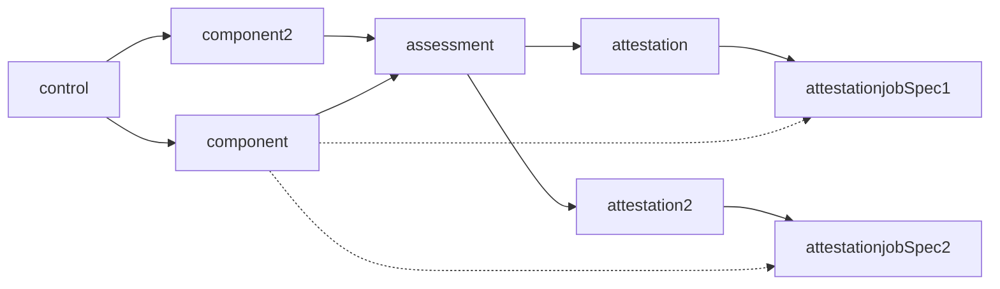
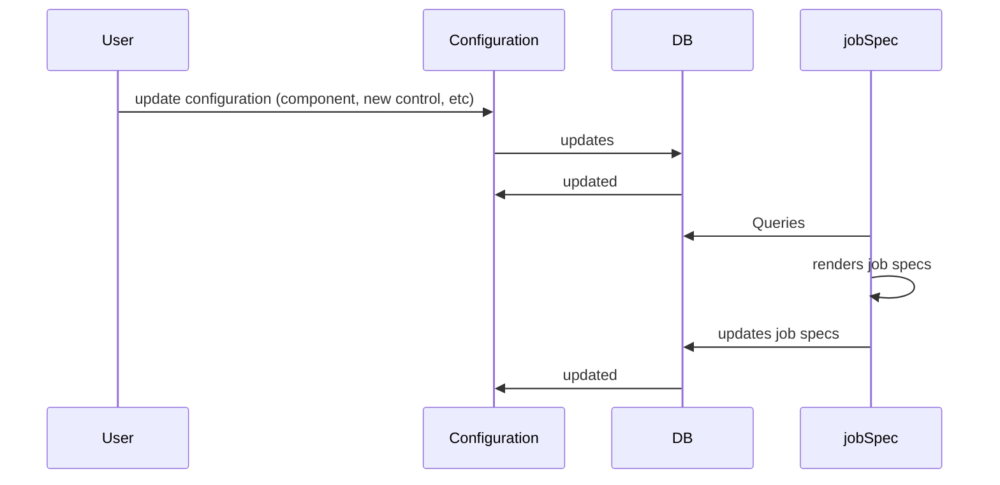
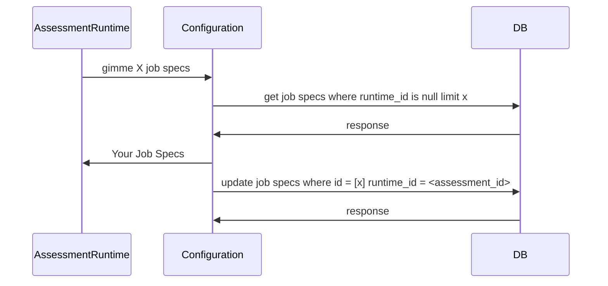
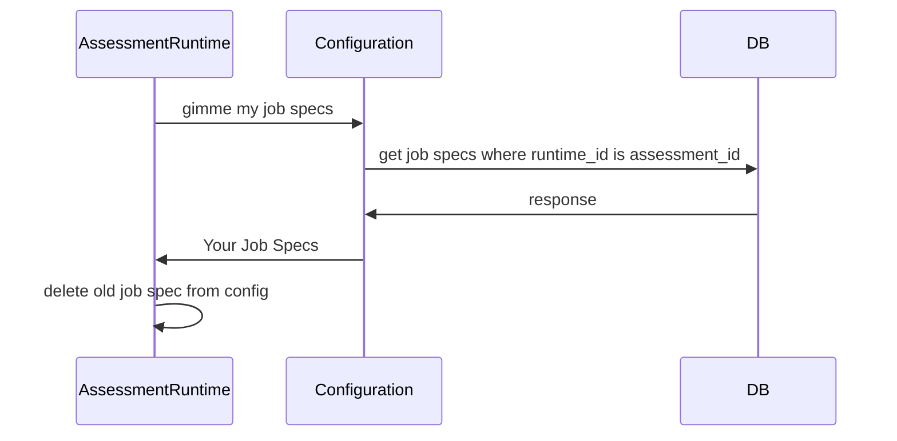

# Configuration Manager

The Configuration Manager is a designed to manage the synchronization between the local configuration and the Configuration Service running in the Control Plane. Its primary role is to ensure that the local system's settings align with those maintained by the Configuration Service. To enable this, the Configuration Manager retrieves the necessary configuration data from the Configuration Service and then stores it locally in the Configuration Store.

## Configuration<->Assessment Sequence Diagrams
How does a Job Spec gets generated:

Sequence Diagram for updating the database

Sequence Diagram for the Assessment Runtime to get more jobs

Because Users can cause a change to the job specs, we need to have a specific flow for checking if the current job specs are still valid and/or changed. The proposed workflow would be something like this:
