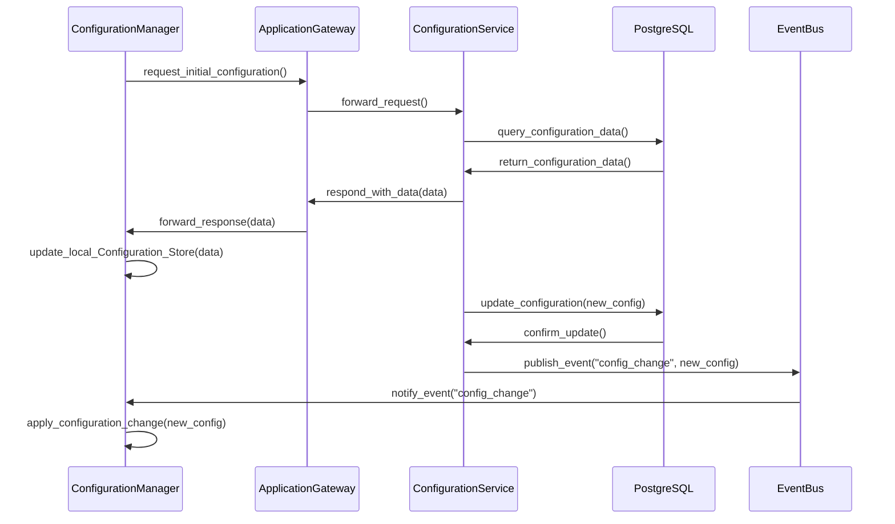

# Configuration Manager

The Configuration Manager is a designed to manage the synchronization between the local configuration and the Configuration Service running in the Control Plane. Its primary role is to ensure that the local system's settings align with those maintained by the Configuration Service. To enable this, the Configuration Manager retrieves the necessary configuration data from the Configuration Service and then stores it locally in the Configuration Store.

:::caution
This design is subject to change, as we still don't have a final decision on whether to use the event bus directly and skip the App Gateway.
:::

- **Initial Configuration Pull**: The **Configuration Manager (CM)** requests the initial configuration from the **Configuration Service (CS)** through the **Application Gateway (AG)**. The Configuration Service queries the data from the **PostgreSQL (PG)** database and returns it, and the Configuration Manager updates its local Configuration Store.

- **Configuration Update**: When there's a change in the configuration, the Configuration Service updates the PostgreSQL database and confirms the update.

- **Event-Driven Updates**: The Configuration Service then publishes an event to the **Event Bus (EB)** on the "config_change" topic, including the new configuration data. The Event Bus notifies the Configuration Manager, which is listening to the "config_change" topic.

- **Apply Configuration Change**: The Configuration Manager applies the new configuration change to the local Configuration Store.

By utilizing an **Event Bus**, the system gains flexibility, allowing multiple components to listen for configuration changes if needed. The publish-subscribe pattern also simplifies the integration between components, promoting a loosely coupled architecture. This pattern can support a variety of use cases and easily adapt to changes in business requirements.

