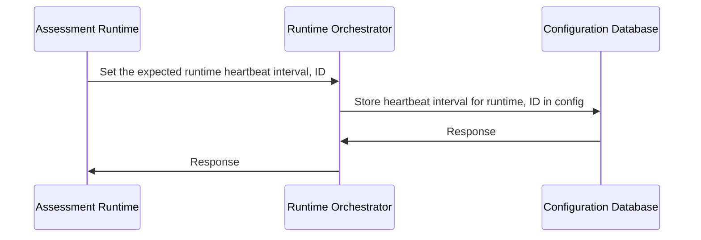

# Heartbeat

## Setting the Heartbeat Interval

1. **Assessment Runtime** requests the **Runtime Orchestrator** to set the expected runtime heartbeat interval, sending its ID as part of the request. This ID uniquely identifies the **Assessment Runtime** within the system.
2. **Runtime Orchestrator** processes the request and stores the specified heartbeat interval for the runtime, along with its corresponding ID, in the configuration within the Configuration Database.
3. The Configuration Database sends a response back to **Runtime Orchestrator** after successfully storing the heartbeat interval and associated ID.
4. Finally, **Runtime Orchestrator** sends a response back to **Assessment Runtime** to confirm that the heartbeat interval has been set.

