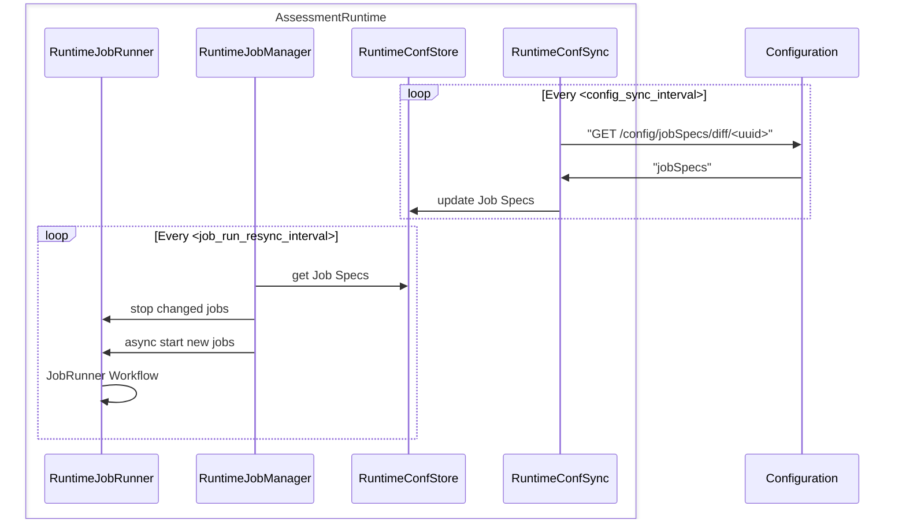
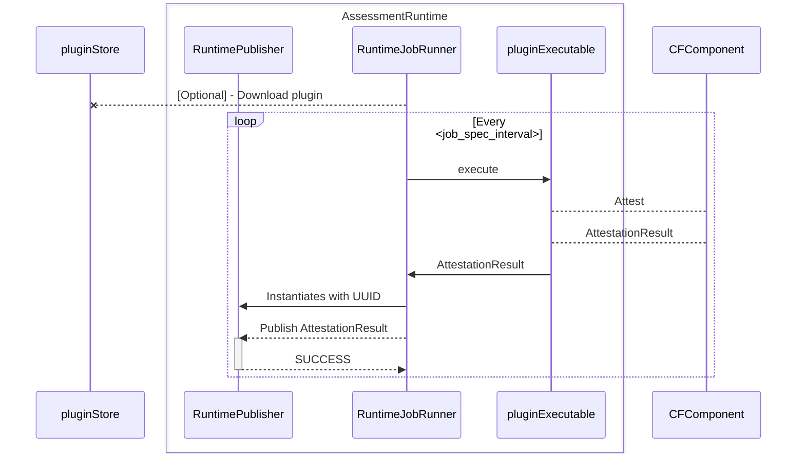

# Job Manager and Job Runner 
Job Manager and Runner are the abstraction responsible to run Attestations. Job Manager is responsible for managing Job Specs and actually verifying how much new specs it can handle, and request them to the Configuration. It also starts Jobrunner instances, according to its queue. Job Runner is responsible for running a given plugin and collect its results and for posting AttestationResults back to the Event Hub.
#### JobManager workflow

#### JobRunner workflow

:::note
Plugin cycle should not be part of this flow, we need to separate it as stated in https://github.com/compliance-framework/website/issues/11
:::
