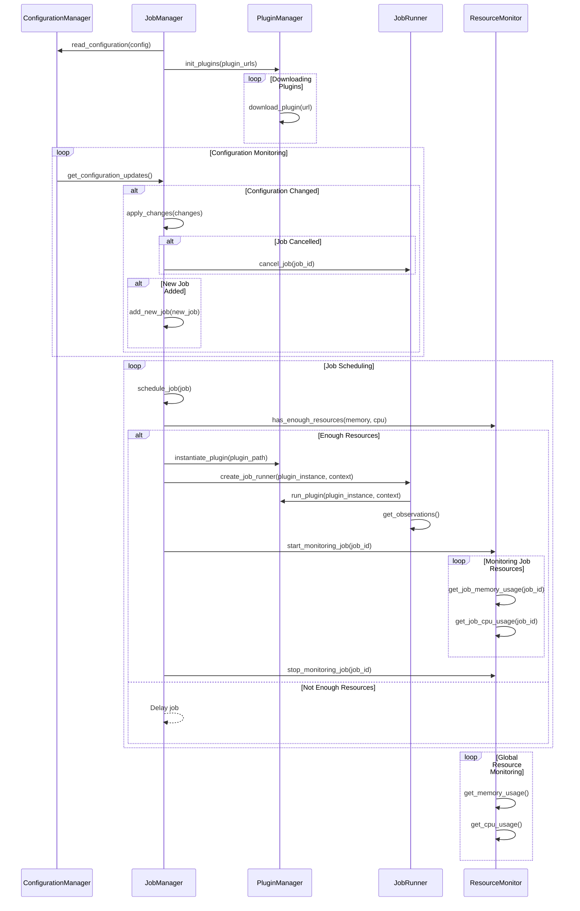

# Job Manager and Job Runner 

Job Manager and Runner are the abstraction responsible to run Attestations. Job Manager is responsible for managing Job Specs and actually verifying how much new specs it can handle, and request them to the Configuration. It also starts Jobrunner instances, according to its queue. Job Runner is responsible for running a given plugin and collect its results and for posting AttestationResults back to the Event Hub.

---

---

### Components:

**Configuration Manager (CM)**: Responsible for managing the configuration of the system, including jobs, plugins, and other settings.

**Job Manager (JM)**: Responsible for scheduling jobs, handling configuration changes, including job cancellations and additions, and coordinating the other components.

**Plugin Manager (PM)**: Responsible for downloading and managing plugins that are executed by the Job Runners.

**Job Runner (JR)**: Responsible for running individual plugins with a given context and collecting observations (results) from the plugins.

**Resource Monitor (RM)**: Continuously monitors global and individual job memory and CPU usage.

---

### Sequence Flow:

1. **Initialization**:
   - **Job Manager** read the initial configuration from **Configuration Manager**.
   - **Job Manager** requests **Plugin Manager** to download and initialize all required plugins.

2. **Configuration Monitoring Loop**:
   - **Configuration Manager** continuously checks for configuration updates and notifies **Job Manager** if changes occur.
   - **Job Manager** applies the changes accordingly, which can include:
     - Canceling existing jobs through **Job Runner**.
     - Adding new jobs to the scheduling queue.

3. **Job Scheduling Loop**:
   - **Job Manager** schedules jobs from the queue, continuously checking with **Resource Monitor** if enough memory and CPU resources are available.
   - If resources are sufficient:
     - **Job Manager** instantiates the plugin through **Plugin Manager**.
     - **Job Manager** creates a **Job Runner** instance, passing the instantiated plugin and context.
     - **Job Runner** runs the plugin through **Plugin Manager**, providing context, and retrieves observations.
     - **Job Manager** starts monitoring the job through **Resource Monitor**.
     - **Resource Monitor** monitors the individual job's memory and CPU usage until **Job Manager** stops monitoring.
   - If not enough resources are available, the job is delayed.

4. **Global Resource Monitoring Loop**:
   - **Resource Monitor** continuously monitors the global memory and CPU usage of the system.
