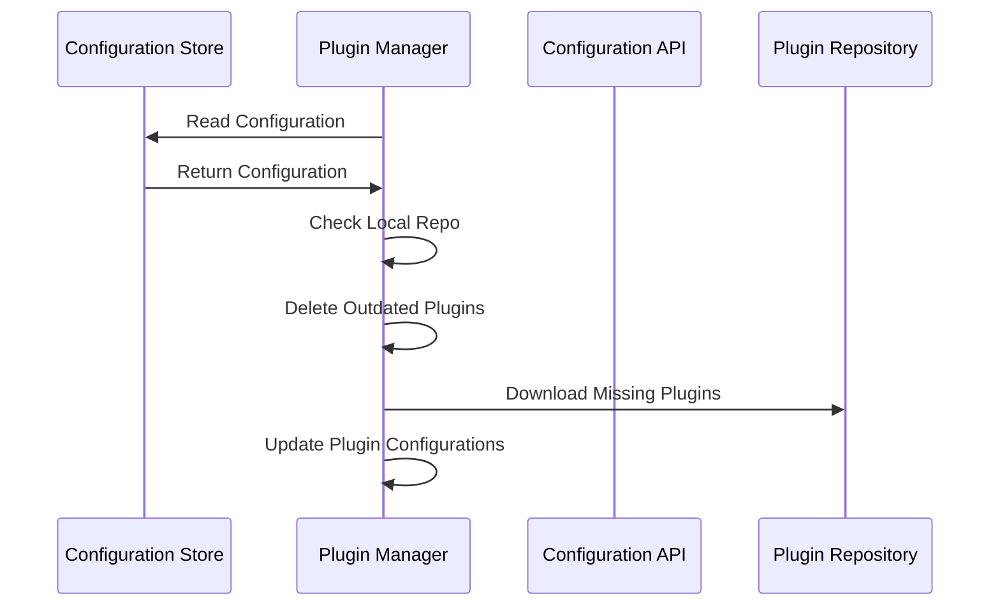

# Plugin Manager

The Plugin Manager is responsible for downloading the Attestation Plugins from the central repository and passing the necessary configuration for them to run.

:::caution
This sequence is subject to change based on the POC that we're going to create, which is built on WASM.
:::

