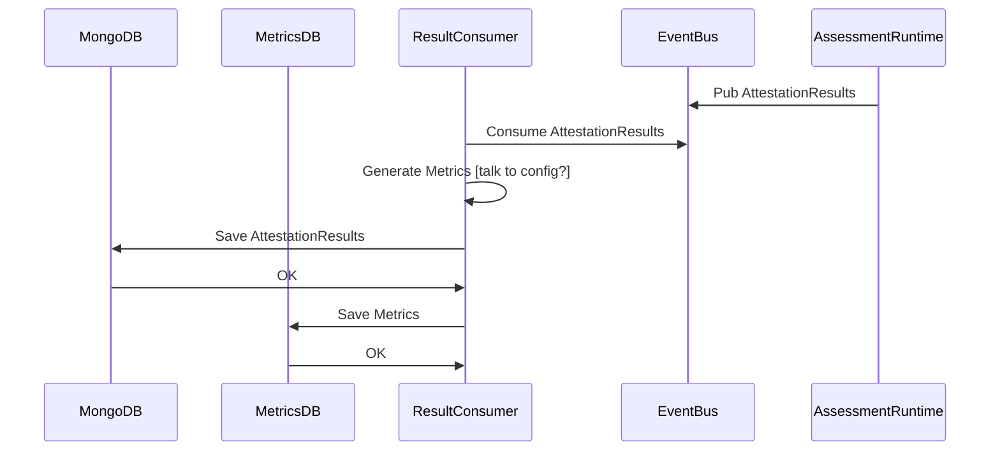
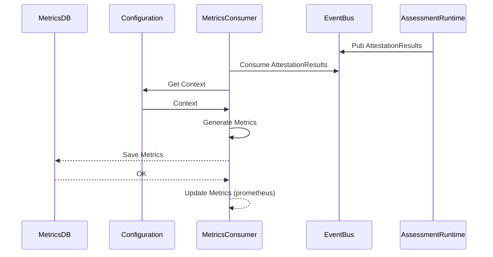

# Assessment Result Consumer

:::caution

There is an issue here whjich is the cost to understand the scenario to properly create the metrics. This could be solved by an update on the Configuration diagrams to also include a responsibility on the configuration to generate a Metrics Plan, and a separate endpoint to add metrics according to the metrics plan.
This needs to be done to a specific service, otherwise it is going to be computationally heavy to update metrics on the configuration (?)

:::

Optionally, the metrics folder might have a second consumer:
