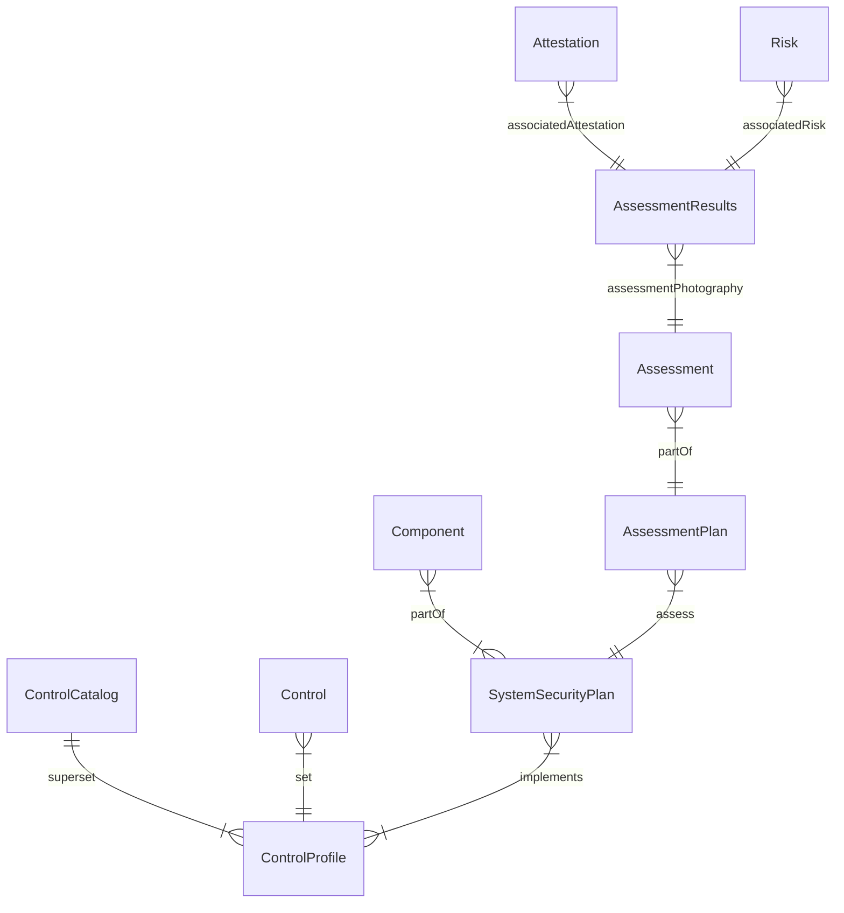
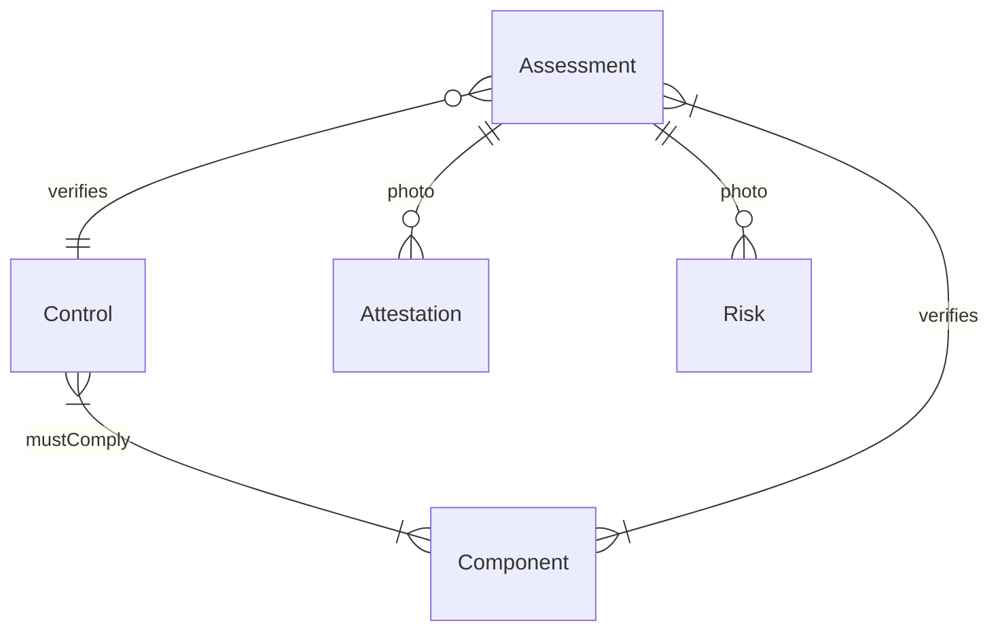
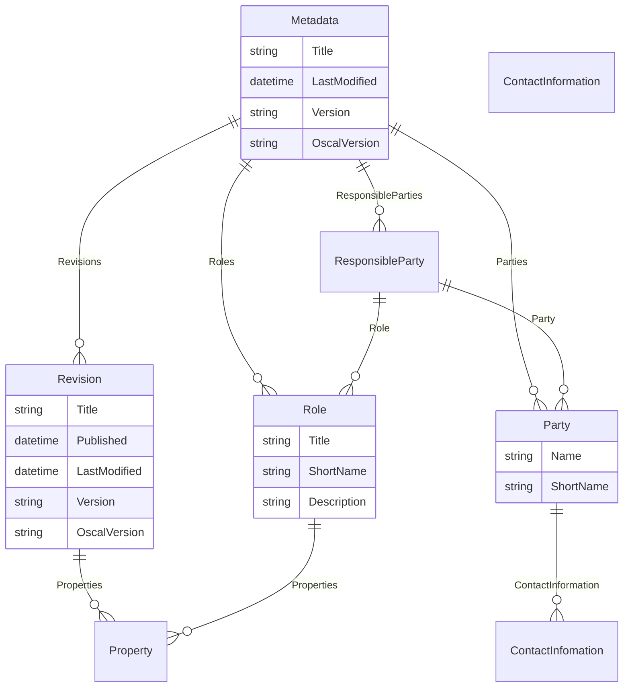
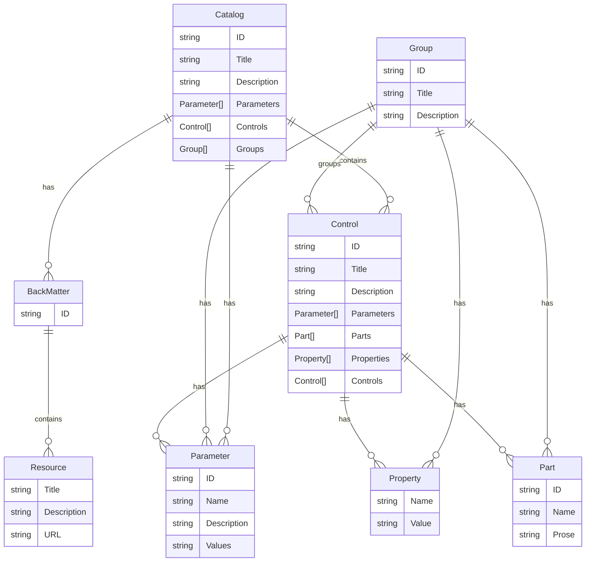

# Entity Relationship Diagrams for Configuration

The purpose of this diagram is to give a high-level view (with no details on fields) of the main entities in the configuration service, which should connect to OSCAL.

### Full OSCAL diagram

Note: `Assessment` is not formally defined on OSCAL, but it is a logical entity that is used to group Assessments whether they have produced a result or not.

### Minimal Diagram (similar to PoC)

### ER Diagram for OSCAL Metadata

### ER Diagram for Control Catalog

