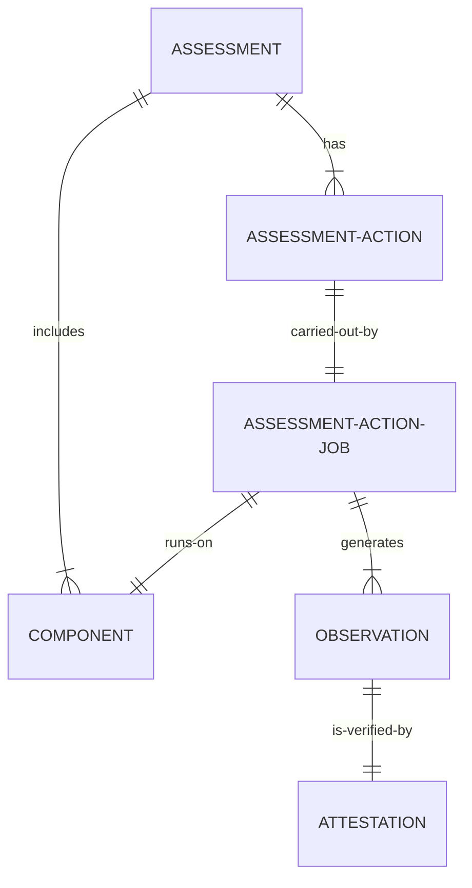

# Core Concepts
This section provides an overview of the core concepts used in the project. It is recommended that you read this section before diving into the details of the architecture.

## Main Models

### Assessment
The overall process of evaluating a specific system, control, or process includes planning, executing various tests or checks, and drawing conclusions about compliance, performance, or quality.

### Assessment Action
Specific tasks or activities within the overall Assessment comprise the actual tests, evaluations, or analyses carried out. In Argus, Assessment Actions are performed using Assessment Action Plugins.

### Observation
Observation refers to the findings or results from an Assessment Action. These are specific details or data gathered during the testing phase. Observations are generated by Assessment Action Plugins during an Assessment run.

### Assessment Action Job
These are the actual instances of Assessment Actions, or in other words, running instances of Assessment Action Plugins. They act as a bridge between Controls, Components, and Assessment Actions. They are managed by the Job Manager runtime component and run in the context provided to them by the Job Runner runtime component.

