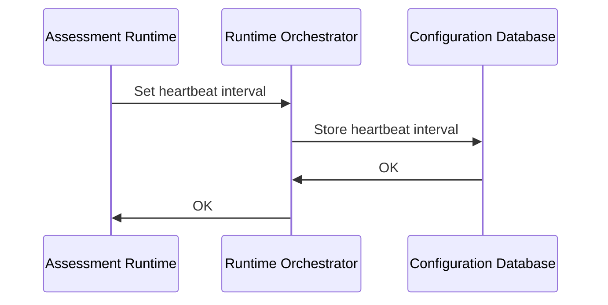
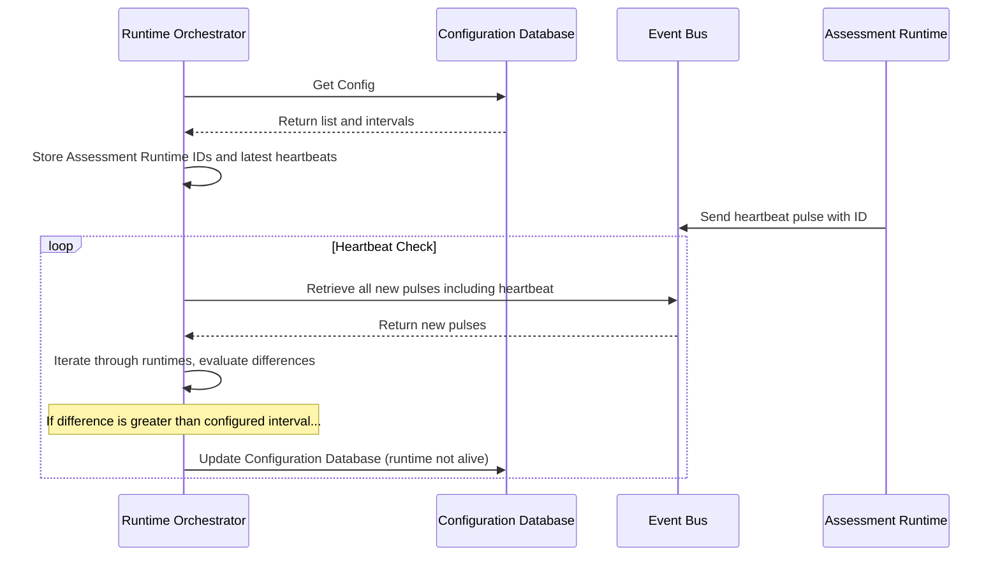

# Heartbeat

## Setting the Heartbeat Interval

1. **Assessment Runtime** requests the **Runtime Orchestrator** to set the expected runtime heartbeat interval, sending its ID as part of the request. This ID uniquely identifies the **Assessment Runtime** within the system.
2. **Runtime Orchestrator** processes the request and stores the specified heartbeat interval for the runtime, along with its corresponding ID, in the configuration within the Configuration Database.
3. The Configuration Database sends a response back to **Runtime Orchestrator** after successfully storing the heartbeat interval and associated ID.
4. Finally, **Runtime Orchestrator** sends a response back to **Assessment Runtime** to confirm that the heartbeat interval has been set.

## Heartbeat Monitoring

1. The **Runtime Orchestrator** retrieves the list of registered **Assessment Runtimes**, along with their configured heartbeat intervals, from the **Configuration Database**.
2. Next, the **Runtime Orchestrator** stores all the **Assessment Runtime** IDs in a list, accompanied by the latest heartbeats retrieved from the **Event Bus**.
3. Following this, the **Assessment Runtime** sends a heartbeat pulse, together with its ID, to the **Event Bus**. This action serves as a "heartbeat" from the **Assessment Runtime**, signaling that it is active and functioning properly.
4. The **Runtime Orchestrator** then gathers all new pulses, including the heartbeat sent by the **Assessment Runtime**, from the **Event Bus** for further processing.
5. Afterward, the **Runtime Orchestrator** iterates through all the runtimes in the list, evaluating the difference between the configured intervals and the timestamps of the latest heartbeats.
6. If the difference between the last time a heartbeat was received and the pre-configured interval is found to be greater, the **Runtime Orchestrator** updates the **Configuration Database**, marking the specific runtime as not alive.

:::note
We also need some kind of notification mechanism to let the administrators know that the runtime is dead.
:::
