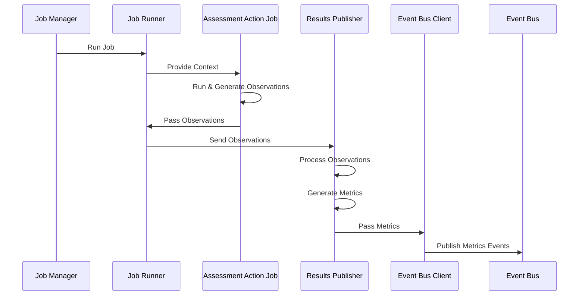

# Results Publisher

The Results Publisher is responsible for receiving the observations from the **Job Runner** and processing them to generate metrics and other analysis results.

1. The flow begins with the **Job Manager** sending a request to the **Job Runner** to run a specific job.
2. Upon receiving the request, the **Job Runner** proceeds to provide the necessary context to the **Assessment Action Job**.
3. The **Assessment Action Job** is executed and runs the compliance checks against the target component.
4. The **Assessment Action Job** then passes these observations to the **Job Runner**.
5. The **Job Runner** sends the observations to the **Results Publisher**.
6. The **Results Publisher** takes the observations and processes them internally. This may involve interpreting, analyzing, or organizing the information.
7. The **Results Publisher** continues its internal operations by generating metrics based on the processed observations. These metrics could represent various measurements or analytics related to the assessment.
8. Finally, the **Results Publisher** communicates with the **Event Bus Client**, passing the generated metrics, and publishes the event to the **Event Bus**.

In summary, the **Results Collector** is central to the process of managing observations from the **Assessment Action Job**s and transforming them into meaningful metrics. It facilitates the flow from task execution to event publication, enabling the analysis of assessment results. This sequence is part of a broader system where the **Results Collector** acts as a bridge between the job execution components and the metrics platform, leading to the distribution of valuable insights.