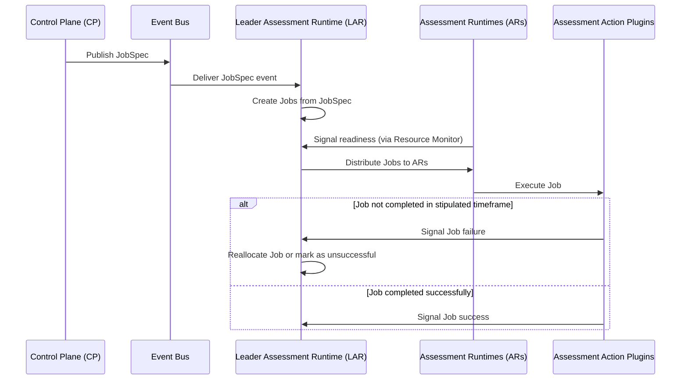

# System Design for Assessment Runtime

The system orchestrates a distributed job execution paradigm using multiple Assessment Runtimes (ARs). Through the RAFT consensus protocol, system consistency is maintained. The Control Plane (CP) publishes JobSpecs on an event bus. The Leader Assessment Runtime (LAR) processes these JobSpecs, creating actual Job instances, and waits for ARs to signal availability before distributing the Jobs.

## System Components

1. **Control Plane (CP):** The CP publishes JobSpecs as events on a dedicated event bus, making them available for consumption by the LAR.

2. **Assessment Runtimes (ARs):**
    - **Resource Monitor:** Each AR has a Resource Monitor that observes its own memory and CPU usage. When it has sufficient resources to handle additional Jobs, it proactively signals the LAR its readiness.
    - **Assessment Action Plugins:** These plugins execute the actual Jobs. When a Job is assigned to an AR, it uses these plugins to run the Job.

3. **Event Bus:** A robust messaging system that facilitates communication between the CP and LAR. It should be scalable, fault-tolerant, and ensure ordered delivery of JobSpecs.

4. **RAFT Consensus Algorithm:** The RAFT algorithm ensures system-wide consistency and provides a mechanism for leader election. By incorporating RAFT, the system gains enhanced fault tolerance, high availability, and ensures consistent operation, especially in scenarios where the LAR might fail.

## System Operation

1. **JobSpec Publishing:** The CP issues a JobSpec and publishes it as an event on the event bus.

2. **Job Creation & Distribution:** The LAR consumes JobSpecs from the event bus, creates Jobs, and holds them in queue, distributing to ARs as they indicate their readiness.

3. **Job Execution:** ARs, upon receiving Jobs from the LAR, execute these Jobs using the Assessment Action Plugins. A **timeout mechanism** ensures efficiency. If a Job isn't completed within a stipulated timeframe, it might be reallocated or marked as unsuccessful.

## Requirements and Assumptions

1. The system is scalable, with a focus on easy integration of new ARs.
2. Communication among the CP, ARs, and LAR should prioritize both security and efficiency.
